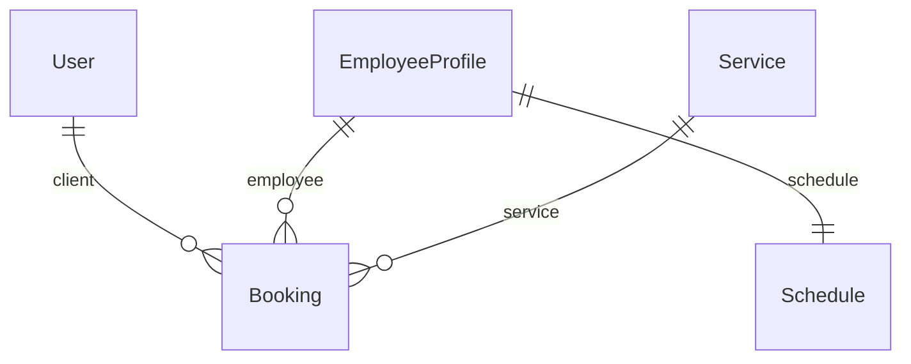

# Database schema

## Entities

### User 
| Field | Type         | Description |
|------|--------------|----------|
| id | BIGINT       | 	Primary key |
| email | VARCHAR(255) | Unique email |
| password | VARCHAR(255) | 	Password hash |
| first_name | VARCHAR(100) | 	First name |
| last_name | VARCHAR(100) | Last name |
| role | VARCHAR(50)  | CLIENT / EMPLOYEE / ADMIN |
| status | VARCHAR(50)  | ACTIVE / BLOCKED |

### EmployeeProfile 
| Field | Type | Description |
|------|-----|----------|
| id | BIGINT | Primary key |
| user_id | BIGINT | Reference to User (FK) |
| specialization | VARCHAR(255) | Specialization |

### Service 
| Field | Type | Description |
|------|-----|----------|
| id | BIGINT | Primary key |
| name | VARCHAR(255) | Service name |
| duration_minutes | INT | 	Duration in minutes |
| description | TEXT | Description |

### Schedule 
| Field | Type | Description |
|------|-----|---------|
| id | BIGINT | Primary key |
| employee_id | BIGINT | Reference to employee (FK) |
| work_day_start | TIME | Work day start time |
| work_day_end | TIME | Work day end time |
| slot_granularity_minutes | INT | Booking slot granularity (minutes) |

### Booking 
| Field | Type | Description |
|------|-----|----------|
| id | BIGINT | Primary key |
| user_id | BIGINT | Client (FK → User) |
| employee_id | BIGINT | Employee (FK → EmployeeProfile) |
| service_id | BIGINT | Service (FK → Service) |
| start_time | TIMESTAMP | Booking start time |
| end_time | TIMESTAMP | Booking end time (calculated) |
| status | VARCHAR(50) | PENDING / CONFIRMED / COMPLETED / CANCELLED |
| created_at | TIMESTAMP | Creation date |
| updated_at | TIMESTAMP | Last update date |

## Relationships

